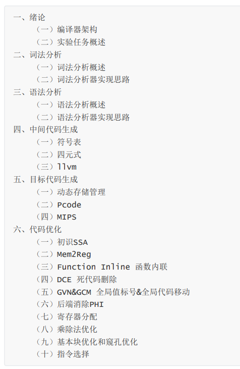

# BUAA-Compiler2023-llvm-pro
## 2023年北京航空航天大学编译原理课程实验 
-  宇宙安全声明：此为预编写指导书，仅代表echo17666个人观点，与课程组无关，一切以最终版本为准。欸嘿~

## 仙人指路
- 前端：<a href="https://github.com/echo17666/BUAA-Compiler2023-llvm-pro/blob/master/前端.md">前端</a>
- 中端：<a href="https://github.com/echo17666/BUAA-Compiler2023-llvm-pro/blob/master/llvm.md">中端</a>

- 如果你想看**官方指导书**，建议按照以下的顺序

- 一，二，三**必看**
- 如果目标码为**PCode**，看四（一），四（二），五（一），五（二）即可
- 如果目标码为**LLVM**，看四（一），四（三）即可
- 如果目标码为**MIPS**，且中间代码为**四元式**，看四（一），四（二），五（一），五（三），六（七），六（八），六（十）即可
- 如果目标码为**MIPS**，且中间代码为**LLVM**，看四（一），四（三），五（一），五（三），六（全部）即可。