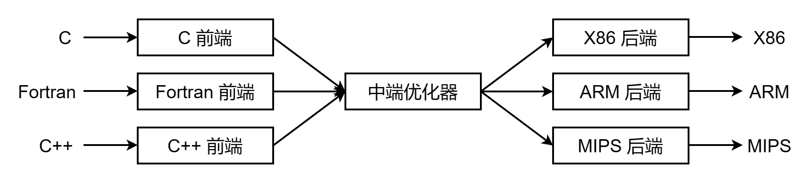
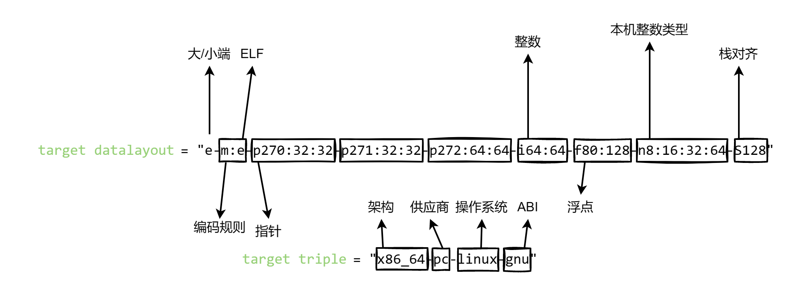
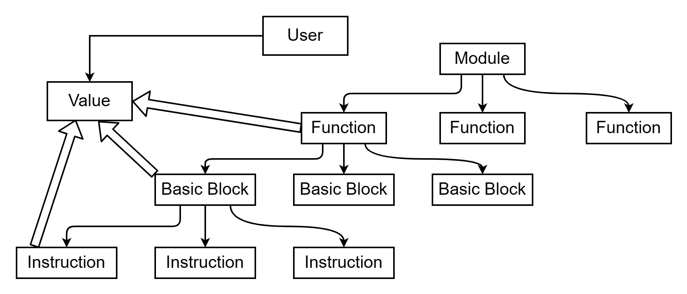

# LLVM从入门到入土
## 写在前面
从这一部分开始，我们将正式开始进入**代码生成**阶段。课程组给出了三种目标码，分别是生成到 **`PCode`** ，**`LLVM IR`** ，以及 **`MIPS`** 。写MIPS需要额外进行**代码优化**的操作。这里建议有时间的同学们可以去提前调研一下这几种代码再进行选择。由于理论课上，以及编译原理的教材上主要介绍了**四元式**，且在课本最后也介绍了PCode，所以采用PCode作为目标码的同学可以主要参考**编译原理教材**。

**`LLVM`** 可能看上去上手比较困难，毕竟我相信大部分同学是第一次接触，而在往年的编译原理课程中，LLVM的代码生成是软件学院的课程要求，指导书也是针对往届软件学院的编译原理实验。在2022年与计算机学院合并之后，课程组虽然也添加了LLVM的代码生成通道，但是由于课程合并后，例如**文法，实验过程，实现要求**等的不同，课程组同学在去年实验中收到了许许多多同届同学关于LLVM的问题，包括**看不懂指导书，无从下手**等问题，所以在今年的指导书中，我们将作出以下改进：
- 根据今年的实验顺序，**重新编排**每一个小实验部分的顺序，使得同学们在实验过程中更加顺畅。
- 对每一个部分进行**相关的说明**，帮助同学们更好地理解LLVM的代码生成过程。
- 会在指导书的每一个章节结束给出一些相对**较强的测试样例**，方便同学们做一个部分就测试一个部分。
- 由于LLVM本身就是一种很优秀的中间代码，所以对于想最终生成到MIPS的同学，今年的指导书中将新增LLVM的**中端优化部分**，帮助同学们更方便地从LLVM生成MIPS代码。

## 0. 简单介绍
### LLVM是什么

**`LLVM`** 最早叫底层虚拟机 (Low Level Virtual Machine) ，最初是伊利诺伊大学的一个研究项目，目的是提供一种现代的、基于SSA的编译策略，能够支持任意编程语言的静态和动态编译。从那时起，LLVM已经发展成为一个由多个子项目组成的伞式项目，其中许多子项目被各种各样的商业和开源项目用于生产，并被广泛用于学术研究。

现在，LLVM被用作实现各种静态和运行时编译语言的通用基础设施（例如，GCC、Java、.NET、Python、Ruby、Scheme、Haskell、D以及无数鲜为人知的语言所支持的语言族）。它还取代了各种特殊用途的编译器，如苹果OpenGL堆栈中的运行时专用化引擎和Adobe After Effects产品中的图像处理库。最后，LLVM还被用于创建各种各样的新产品，其中最著名的可能是OpenCL GPU编程语言。

> ~~看不懂不要紧，反正我也是官网上找的介绍~~~
> 
> 一些参考资料：
> - https://aosabook.org/en/v1/llvm.html#footnote-1
> - https://llvm.org/

### 三端设计
传统静态编译器，例如大多数C语言的编译器，最主流的设计是**三端设计**，其主要组件是前端、优化器和后端。前端解析源代码，检查其错误，并构建特定语言的**抽象语法树 `AST`**(Abstract Syntax Tree)来表示输入代码。AST可以选择转换为新的目标码进行优化，优化器和后端在代码上运行。

**`优化器`** 的作用是**增加代码的运行效率**，例如消除冗余计算。 **`后端`** ，也即代码生成器，负责将代码**映射到目标指令集**，其常见部分包括指令选择、寄存器分配和指令调度。

当编译器需要支持**多种源语言或目标体系结构**时，使用这种设计最重要的优点就是，如果编译器在其优化器中使用公共代码表示，那么可以为任何可以编译到它的语言编写前端，也可以为任何能够从它编译的目标编写后端，如图 0-1 所示。



##### <p align="center">图 0-1 三端设计示意图</p>

官网对这张设计图的描述只有一个单词 **Retargetablity**，译为**可重定向性**或**可移植性**。通俗理解，如果需要移植编译器以支持新的源语言，只需要实现一个新的前端，但现有的优化器和后端可以重用。如果不将这些部分分开，实现一种新的源语言将需要从头开始，因此，不难发现，支持 $N$ 个目标和 $M$ 种源语言需要 $N×M$ 个编译器，而采用三端设计后，中端优化器可以复用，所以只需要 $N+M$ 个编译器。例如我们熟悉的Java中的 **`JIT`** ， **`GCC`** 都是采用这种设计。

**`IR`** (Intermediate Representation) 的翻译即为中间表示，在基于LLVM的编译器中，前端负责解析、验证和诊断输入代码中的错误，然后将解析的代码转换为LLVM IR，中端（此处即LLVM优化器）对LLVM IR进行优化，后端则负责将LLVM IR转换为目标语言。

### 工具介绍
> 讲道理这一节应该配合下一节一起食用，但是下一节需要用到这些工具，就先放前面写了。

我们的实验目标是将C语言的程序生成为LLVM IR的中间代码，尽管我们会给指导书，但不可避免地，同学们还会遇到很多不会的情况。所以这里给出一个能够自己进行代码生成测试的工具介绍，帮助大家更方便地测试和完成实验。

这里着重介绍 **`Ubuntu`** (20.04或更新) 的下载与操作，一是方便，二是感觉大家或多或少有该系统的Vmware或者云服务器等等。
> 如果真的没有，腾讯云学生优惠有Ubuntu 20.04的云服务器，9.9RMB一年，如果实在不想花钱，也可以在Windows或MacOS上直接装。MacOS和Windows安装Clang和LLVM的方法请自行搜索。

首先安装 **`LLVM`** 和 **`Clang`** 
```bash
$ sudo apt-get install llvm
$ sudo apt-get install clang
```
安装完成后，输入指令查看版本。如果出现版本信息则说明安装成功。
```bash
$ clang -v 
$ lli --version 
```
> **注意：** 请务必保证llvm版本至少是**10.0.0 及以上**，否则**会影响正确性！**

如果使用apt无法安装，则将下列代码加入到 `/etc/apt/sources.list` 文件中
```bash
deb http://apt.llvm.org/focal/ llvm-toolchain-focal-10 main
deb-src http://apt.llvm.org/focal/ llvm-toolchain-focal-10 main
```
然后在终端执行
```bash
wget -O - https://apt.llvm.org/llvm-snapshot.gpg.key|sudo apt-key add -
apt-get install clang-10 lldb-10 lld-10
```
**`MacOS`** 上的安装也稍微提一嘴，需要安装XCode或XCode Command Line Tools, 其默认自带Clang
```bash
xcode-select --install
brew install llvm
```
安装完成后，需要添加LLVM到$PATH
```bash
echo 'export PATH="/usr/local/opt/llvm/bin:$PATH"' >> ~/.bash_profile
```
这时候可以仿照之前查看版本的方法，如果显示版本号则证明安装成功。

我们安装的 **`Clang`** 是 LLVM 项目中 C/C++ 语言的前端，其用法与 GCC 基本相同。
 **`lli`** 会解释.bc 和 .ll 程序。

具体如何使用上述工具链，我们将在下一章介绍。
### LLVM IR示例
LLVM IR 具有三种表示形式，一种是在**内存中**的数据结构格式，一种是在磁盘二进制 **位码 (bitcode)** 格式 **`.bc`** ，一种是**文本格式** **`.ll`** 。生成目标代码为LLVM IR的同学要求输出的是 **`.ll`** 形式的 LLVM IR。

作为一门全新的语言，与其讲过于理论的语法，不如直接看一个实例来得直观，也方便大家快速入门。

例如，我们的源程序 `main.c` 如下
```c
int a=1;
int add(int x,int y){
    return x+y;
}
int main(){
    int b=2;
    return add(a,b);
}
```
现在，我们想知道其对应的LLVM IR长什么样。这时候我们就可以用到Clang工具。下面是一些常用指令
```bash
$ clang main.c -o main # 生成可执行文件
$ clang -ccc-print-phases main.c # 查看编译的过程
$ clang -E -Xclang -dump-tokens main.c # 生成 tokens
$ clang -fsyntax-only -Xclang -ast-dump main.c # 生成语法树
$ clang -S -emit-llvm main.c -o main.ll -O0 # 生成 llvm ir (不开优化)
$ clang -S main.c -o main.s # 生成汇编
$ clang -c main.c -o main.o # 生成目标文件
```
输入 `clang -S -emit-llvm main.c -o main.ll` 后，会在同目录下生成一个 `main.ll` 的文件。在LLVM中，注释以';'打头。
```llvm
; ModuleID = 'main.c'     
source_filename = "main.c"  
target datalayout = "e-m:e-p270:32:32-p271:32:32-p272:64:64-i64:64-f80:128-n8:16:32:64-S128"
target triple = "x86_64-pc-linux-gnu"


; 从下一行开始，是实验需要生成的部分，注释不要求生成。
@a = dso_local global i32 1, align 4 

; Function Attrs: noinline nounwind optnone uwtable 
define dso_local i32 @add(i32 %0, i32 %1) #0 {
  %3 = alloca i32, align 4
  %4 = alloca i32, align 4
  store i32 %0, i32* %3, align 4
  store i32 %1, i32* %4, align 4
  %5 = load i32, i32* %3, align 4
  %6 = load i32, i32* %4, align 4
  %7 = add i32 %5, %6
  ret i32 %7
}

; Function Attrs: noinline nounwind optnone uwtable 
define dso_local i32 @main() #0 {
  %1 = alloca i32, align 4
  %2 = alloca i32, align 4
  store i32 0, i32* %1, align 4
  store i32 2, i32* %2, align 4
  %3 = load i32, i32* @a, align 4
  %4 = load i32, i32* %2, align 4
  %5 = call i32 @add(i32 %3, i32 %4)
  ret i32 %5
}

; 实验要求生成的代码到上一行即可

attributes #0 = { noinline nounwind optnone uwtable ...}
; ...是我自己手动改的，因为后面一串太长了

!llvm.module.flags = !{!0}
!llvm.ident = !{!1}

!0 = !{i32 1, !"wchar_size", i32 4}
!1 = !{!"clang version 10.0.0-4ubuntu1 "}
```
用`lli main.ll`解释执行生成的 .ll 文件。如果一切正常，输入`echo $?`查看上一条指令的返回值。

在本次实验中，我们会用到一些库函数。使用的时候请将 <a href="https://github.com/echo17666/BUAA-Compiler2023-llvm-pro/tree/master/files/libsysy.c">`libsysy.c`</a> 和 <a href="https://github.com/echo17666/BUAA-Compiler2023-llvm-pro/tree/master/files/libsysy.h">`libsysy.h`</a>放在同一目录下，对使用到了库函数的源程序进行编译时，需要用到如下指令：

```bash
# 1. 分别导出 libsysy 和 main.c 对应的的 .ll 文件
$ clang -emit-llvm -S libsysy.c -o lib.ll
$ clang -emit-llvm -S main.c -o main.ll

# 2. 使用 llvm-link 将两个文件链接，生成新的 IR 文件
$ llvm-link main.ll lib.ll -S -o out.ll

# 3. 用 lli 解释运行
$ lli out.ll
```

粗略一看，LLVM IR很长很麻烦，但仔细一看，在我们需要生成的代码部分，像是一种特殊的三元式。事实上，LLVM IR使用的是**三地址码**。我们对上述代码进行简要注释。

- Module ID：指明 **`Module`** 的标识
- source_filename：表明该Module是从什么文件编译得到的。如果是通过链接得到的，此处会显示 `llvm-link`
- target datalayout 和 target triple 是程序标签属性说明，和硬件/系统有关。其各个部分说明如下图所示。

##### <p align="center">图 0-2 target解释</p>

- `@a = dso_local global i32 1, align 4`：全局变量，名称是a，类型是i32，初始值是1，对齐方式是4字节。dso_local 表明该变量会在同一个链接单元内解析符号。
- `define dso_local i32 @add(i32 %0, i32 %1) #0`：函数定义。其中第一个i32是返回值类型，%add是函数名；第二个和第三个i32是形参类型，%0，%1是形参名。
> llvm中的标识符分为两种类型：全局的和局部的。全局的标识符包括函数名和全局变量，会加一个`@`前缀，局部的标识符会加一个`%`前缀。
- #0指出了函数的`attribute group`。在文件的最后，也能找到对应的attributes #0。因为attribute group可能很包含很多attribute且复用到多个函数，所以我们IR使用attribute group ID(即#0)的形式指明函数的attribute，这样既简洁又清晰。
- 而在大括号中间的函数体，是由一系列 **`BasicBlock`** 组成的。每个BasicBlock都有一个**label**，label使得该BasicBlock有一个符号表的入口点，其以terminator instruction(ret、br等)结尾的。每个BasicBlock由一系列 **`Instruction`** 组成。Instruction是LLVM IR的基本指令。
- %7 = add i32 %5, %6：随便拿上面一条指令来说，%7是Instruction的实例，它的操作数里面有两个值，一个是%5，一个是%6。%5和%6也是Instruction的实例。

下面给出一个Module的主要架构，可以发现，LLVM中几乎所有的结构都可以认为是一个 **`Value`** ，结构与结构之间的Value传递可以简单理解为继承属性和综合属性。而 **`User`** 类和 **`Use`** 类则是LLVM中的重要概念，简单理解就是，User类存储使用Value的列表，而Use类存储Value和User的使用关系，这可以让User和Value快速找到对方。

##### <p align="center">图 0-3 LLVM架构简图</p>
这其中架构的设计，是为了方便LLVM的优化和分析，然后根据优化过后的Module生成后端代码。同学们可以根据自己的需要自行设计数据类型。但如果只是想生成到LLVM的同学，这部分内容其实没有那么重要，可以直接面向AST生成代码。

对于一些常用的Instructions，下面给出示例。对于一些没有给出的，可以参考[LLVM IR指令集](https://llvm.org/docs/LangRef.html#instruction-reference)。

| llvm ir | 使用方法 | 简介 |
| ---| --- | --- |
| add | ` <result> = add <ty> <op1>, <op2>` | / |
| sub     | `<result> = sub <ty> <op1>, <op2>` | / |
| mul     | `<result> = mul <ty> <op1>, <op2> ` | / |
| sdiv    | `<result> = sdiv <ty> <op1>, <op2>  ` | 有符号除法 |
| icmp    | `<result> = icmp <cond> <ty> <op1>, <op2>   ` | 比较指令 |
| and     | `<result> = and <ty> <op1>, <op2>  ` | 与 |
| or      | `<result> = or <ty> <op1>, <op2>   `  | 或 |
| call    | `<result> =  call  [ret attrs]  <ty> <fnptrval>(<function args>)` | 函数调用 |
| alloca  | `  <result> = alloca <type> ` | 分配内存 |
| load    | `<result> = load  <ty>, <ty>* <pointer>` | 读取内存 |
| store   | `store  <ty> <value>, <ty>* <pointer>` | 写内存 |
| getelementptr | `<result> = getelementptr <ty>, * {, [inrange] <ty> <idx>}*` <br>  `<result> = getelementptr inbounds <ty>, <ty>* <ptrval>{, [inrange] <ty> <idx>}*` | 计算目标元素的位置（这一章会单独详细说明） |
| phi | `<result> = phi [fast-math-flags] <ty> [ <val0>, <label0>], ...` |/|
| zext..to | `<result> = zext <ty> <value> to <ty2>  ` | 将 `ty`的`value`的type扩充为`ty2` |
| trunc..to | `<result> = trunc <ty> <value> to <ty2>  ` | 将 `ty`的`value`的type缩减为`ty2` |
| br      | `br i1 <cond>, label <iftrue>, label <iffalse>` <br> `br label <dest>  ` | 改变控制流  |
| ret     | `ret <type> <value> `  ,`ret void  ` | 退出当前函数，并返回值 |

### 一些说明
- 如果目标生成到LLVM语言的同学请注意，clang 默认生成的虚拟寄存器是**按数字顺序**命名的，LLVM 限制了所有数字命名的虚拟寄存器必须严格地**从 0 开始递增**，且每个函数参数和基本块都会占用一个编号。如果你不能确定怎样用数字命名虚拟寄存器，请使用**字符串命名**虚拟寄存器。
- 由于本指导书的大量测试样例都是LLVM IR的代码，所以我们主要讲通过 **`AST`** 生成对应的代码。想通过LLVM IR的同学可以根据对应的 **`Module`** 结构自行存储数据，然后根据Module生成对应的LLVM IR代码自测。
## 1. 主函数与常量表达式
### 主函数
首先我们从最基本的开始，即只包含return语句的主函数（或没有参数的函数）。可能用到的文法包括
```c
CompUnit -> FuncDef
FuncDef  -> FuncType Ident '(' ')' Block
FuncType -> 'int'
Ident    -> 'main'
Block    -> '{' Stmt '}'
Stmt     -> 'return' Number ';'
```
对于一个无参的函数，首先需要从AST获取函数的名称，返回值类型。然后分析函数体的Block。Block中的Stmt可以是return语句，也可以是其他语句，但是这里只考虑return语句。return语句中的Number在现在默认是**常数**。
所以对于一个代码生成器，我们需要实现的功能有：
- 遍历**AST**，遍历到函数时，获取函数的**名称**、**返回值类型**
- 遍历到**Block**内的**Stmt**时，如果是**return**语句，生成或保存对应的**Instruction**
### 常量表达式
新增内容有
```c
Stmt       -> 'return' Exp ';'
Exp        -> AddExp
AddExp     -> MulExp 
              | AddExp ('+' | '−') MulExp
MulExp     -> UnaryExp
              | MulExp ('*' | '/' | '%') UnaryExp
UnaryExp   -> PrimaryExp | UnaryOp UnaryExp
PrimaryExp -> '(' Exp ')' | Number
UnaryOp    -> '+' | '-'
``` 
对于常量表达式，这里只包含常数的四则运算，正负号操作。这时候我们就需要用到之前的Value思想。举个例子，对于 `1+2+3*4`，我们生成的AST样式如下

##### <p align="center">图 1-1 简单四则运算AST参考图</p>
那么在生成的时候，我们的顺序是从左到右，从上到下。所以我们可以先生成 `1`，然后生成 `2`，然后生成 `1+2`，然后生成 `3`，然后生成 `4`，然后生成 `3*4`，最后生成 `1+2+3*4`。那对于1+2的**AddExp**，在其生成的指令中，1和2的值就类似于综合属性，即从AddExp的实例的值（3）由产生式右边的值（1和2）推导出来。而对于3\*4的**MulExp**，其生成的指令中3和4的值就类似于继承属性，即从MulExp的实例的值（12）由产生式左边的值（3和4）推导出来。最后，对于1+2+3\*4的**AddExp**，生成指令的实例的值就由产生式右边的AddExp的值（3）和MulExp的值（12）推导出来。

同理，对于数字前的正负，我们可以看做是**0和其做一次AddExp**，即+1其实就是0+1 （其实正号甚至都不用去管他） ，-1其实就是0-1。所以在生成代码的时候，可以当作一个特殊的AddExp来处理。
### 测试样例
源程序
```c
int main() {
    return --+---+1 * +2 * ---++3 + 4 + --+++5 + 6 + ---+--7 * 8 + ----++--9 * ++++++10 * -----11;
}
```
生成代码参考（因为最后的代码是扔到评测机上重新编译去跑的，所以生成的代码不一定要一样，但是要确保输出结果一致）
```llvm
define dso_local i32 @main() {
    %1 = sub i32 0, 1
    %2 = sub i32 0, %1
    %3 = sub i32 0, %2
    %4 = sub i32 0, %3
    %5 = sub i32 0, %4
    %6 = mul i32 %5, 2
    %7 = sub i32 0, 3
    %8 = sub i32 0, %7
    %9 = sub i32 0, %8
    %10 = mul i32 %6, %9
    %11 = add i32 %10, 4
    %12 = sub i32 0, 5
    %13 = sub i32 0, %12
    %14 = add i32 %11, %13
    %15 = add i32 %14, 6
    %16 = sub i32 0, 7
    %17 = sub i32 0, %16
    %18 = sub i32 0, %17
    %19 = sub i32 0, %18
    %20 = sub i32 0, %19
    %21 = mul i32 %20, 8
    %22 = add i32 %15, %21
    %23 = sub i32 0, 9
    %24 = sub i32 0, %23
    %25 = sub i32 0, %24
    %26 = sub i32 0, %25
    %27 = sub i32 0, %26
    %28 = sub i32 0, %27
    %29 = mul i32 %28, 10
    %30 = sub i32 0, 11
    %31 = sub i32 0, %30
    %32 = sub i32 0, %31
    %33 = sub i32 0, %32
    %34 = sub i32 0, %33
    %35 = mul i32 %29, %34
    %36 = add i32 %22, %35
    ret i32 %36
}
```