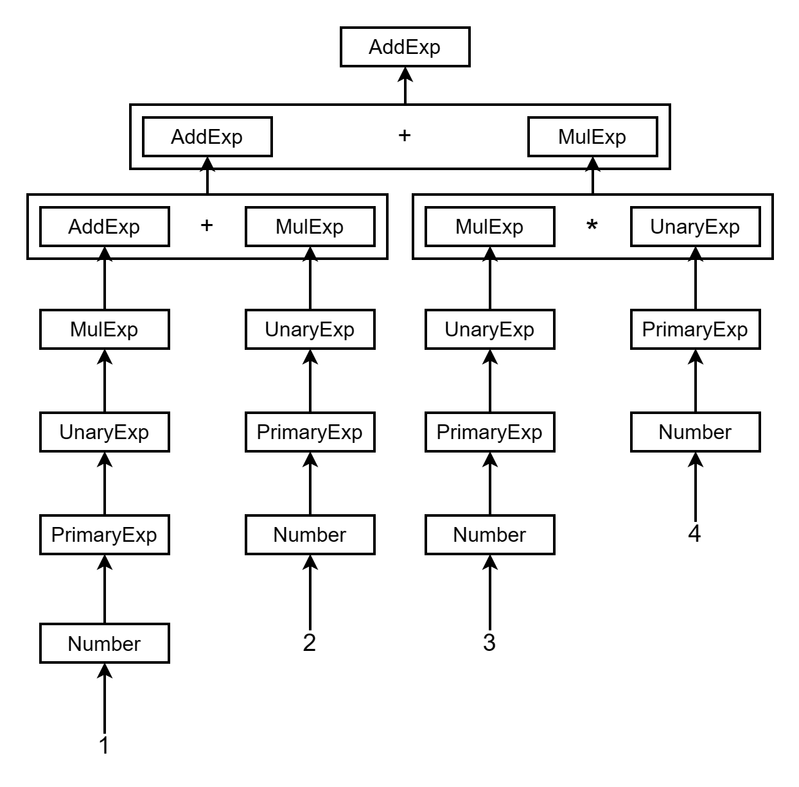
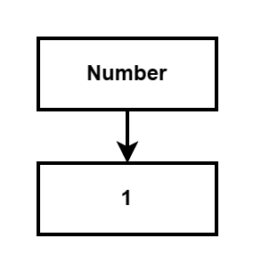
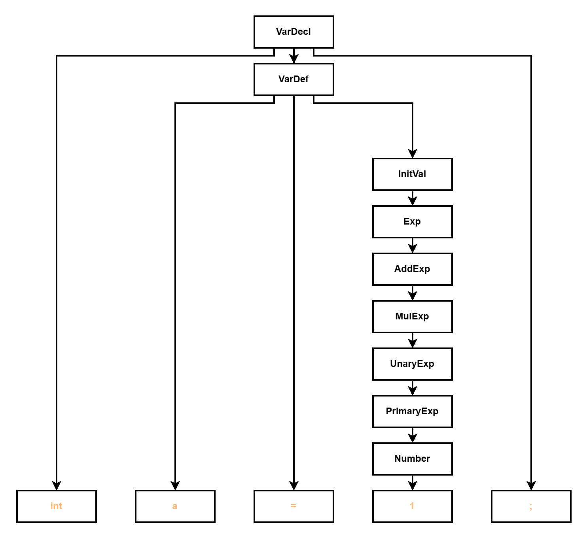
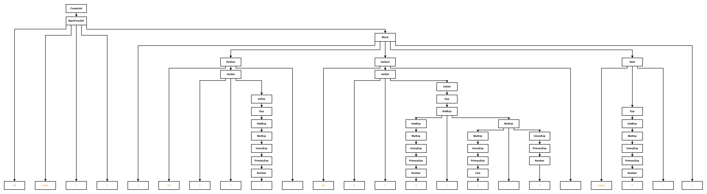

# 从零开始
## 免责声明
这个是我自己根据自己的经验写的一份指导书，目前分为前端中端，前端是这份指导书，包含词法分析和语法分析，中端为llvm.md，包含代码生成。前端指导书为**个人经验指导书**，仅供参考，肯定没有课程指导书全面，中端指导书为**课程组llvm部分指导书的预编写版本**，大差不差，不代表课程组，只代表echo17666个人观点，如有错误，欢迎指正。

## 总览
前端占实验总分的40%，包含期中考试和错误处理部分，前端部分和理论部分密切相关，即只要理论认真听讲实验是没有难度的。建议先将编译理论教材的前四章看完，尤其重点关注以下内容
- **第一章编译总览**：编译器的五个部分，即**词法分析，语法分析，语义分析和中间代码生成，代码优化，目标码生成**。同时**符号表**和**错误处理**贯穿整个编译器。这是编译的基本步骤，了解之后对编译器的整体设计有较大帮助。
- **第二章文法解读**：看懂文法即可，尤其关注**扩充的BNF范式**，这是编译器的基础，实验给的文法也是基于扩充BNF范式给的，后面的词法分析和语法分析都是基于文法的。同时关注语法树的构建，这是语法分析的基础。
- **第三章词法分析**：重点关注分词，即如何将文件里面的一串字符分为一个个词，并且分为不同类别（保留字，标识符，常数，运算符，界符等），这是词法分析的基础。
- **第四章语法分析**：重点关注**递归下降子程序**。理论看懂实验就会写，亲测好用。

具体而言，前端不需要什么特殊的数据结构，具体来说，只要实现词法器+语法器就行。
## 词法分析
词法分析其实和理论没什么相关性，只需要知道，词法分析器，输入的是最原始的.txt文件，输出的是一个**Token库**就行。

那Token库是什么呢？举个栗子，比如说我们有一个.txt文件，内容如下
```c
int main(){
    int n;
    int i=0
    n=getint();
    for(;;){
        i=i+1;
        if(i%2==1){
            continue;
        }
        printf("%d\n",i)
        if(i>n){
            break;
        }
    }
    printf("hi");
    return 0;
}
```
输出的是Token库，内容如下
```c
INTTK int
MAINTK main
LPARENT (
RPARENT )
LBRACE {
INTTK int
IDENFR n
SEMICN ;
INTTK int
IDENFR i
SEMICN ;
IDENFR n
ASSIGN =
GETINTTK getint
LPARENT (
RPARENT )
SEMICN ;
FORTK for
LPARENT (
IDENFR i
ASSIGN =
INTCON 0
SEMICN ;
IDENFR i
LSS <
IDENFR n
SEMICN ;
IDENFR i
ASSIGN =
IDENFR i
PLUS +
INTCON 1
RPARENT )
LBRACE {
IFTK if
LPARENT (
IDENFR i
MOD %
INTCON 2
EQL ==
INTCON 1
RPARENT )
LBRACE {
CONTINUETK continue
SEMICN ;
RBRACE }
PRINTFTK printf
LPARENT (
STRCON "%d\n"
COMMA ,
IDENFR i
RPARENT )
SEMICN ;
RBRACE }
PRINTFTK printf
LPARENT (
STRCON "hi"
RPARENT )
SEMICN ;
RETURNTK return
INTCON 0
SEMICN ;
RBRACE }
```
不难看出，词法分析中最主要的就是**分词器**，即将.txt文件中的一串字符分为一个个词，并判断类别。如何去将字符串分成一个个的词便是词法分析的核心。我个人建议将词分为两类，一类是特殊符号，即遇到特殊符号就开始分词，例如 **+ - * / , ; ( )** 等，遇到特殊符号或空格或换行符之后就开始分词，然后对于分出来的词去判断是否为保留字，例如 **main,const,int,if,else,break,continue** 等，如果为保留字按保留字处理，否则判断是否为纯数字，是的话按数字处理，否则按IDENT即一般字符处理。这样就可以将.txt文件分为一个个的词了。

值得注意的是，词法分析的难点在于注释的判断，即 **//** 后的一整行内容都不进入词法分析，而 **/\* \*/** 中间的内容也不进入词法分析，即使这之间隔了几十行。可以说，词法分析需要包含各种阴间情况，例如 **\*/** 之后刚好是EOF或者\n，或者//和/*同时出现等等，这些是需要同学自己去考虑的。词法分析作为编译器的第一步，需要保证**绝对的正确性**，即使是一个字符的错误都不能出现，否则后面的语法分析就会出现各种各样的问题，所以词法分析的正确性是编译器的基础。

- p.s. 词法分析完全可以自己写，一方面是因为不难，一方面是因为怎么实现都可以，而之后的语法分析的处理方法较为同质化，所以词法分析自己写也可以降低查重率。


## 语法分析
语法分析的写法非常多，但是最简单方便的还是**递归下降子程序**，一是因为好实现，二是因为理论教过。所以简单。（以及，递归下降子程序是小测必考题目）

语法分析的作用是，输入词法分析生成的**Token库**，输出**抽象语法树AST**，当然也可以输出四元式，但我个人并不推荐这么做。

什么是AST？这里我借用中端的一张插图大概就能理解了。



如果我们仔细观察文法，会发现任何一个符合文法的程序，最后都会拆解成到Token级别，也就是说，我们可以通过输入的有顺序的**Token表**去匹配文法，然后**自底向上构建一棵树**。

举个栗子，如果源程序如下
```c
int main(){
    int a=1;
    int b=3+a*2;
    return 0;
}
```
拿出我们的文法表，首先我们匹配**CompUnit**，即最外面一层文法，然后判断**当前Token**为 **`int`** 。此时匹配文法，寻找文法的**First集**（不知道什么是First集合的罚你去复习理论知识），发现FuncDef和MainFuncDef的**First集**都包含int，这时候判断下一个token，发现下一位token是 **`main`** ，可以和MainFuncDef匹配上，故进入MainFuncDef文法。

在MainFuncDef中，依次匹配 **`int`** ， **`main`** ， **`(`** ， **`)`** 。此时Token为 **`{`** ，匹配文法依次进入**Block**，(BlockItem不输出)，(Decl不输出)，**VarDecl**，然后读到 **`int`** ，和BType匹配（输出的时候不考虑BType），然后进入**VarDef**，读到 **`a`** ，和Ident匹配，然后匹配 **`=`** ，进入**InitVal**，**Exp**，**AddExp**，**MulExp**，**UnaryExp**，**PrimaryExp**，**Number**，然后在Number之后展开是 **`1`** （输出的时候不考虑IntConst）

如果上述过程你能完整跟下来，那这时候不难发现，Number读完了，这时候**Number**文法展开结束了，我们这时候可以将Token建立一颗树，即将文法左边作为根节点，文法右边作为叶节点，建立一颗树，如下所示。

<div align="center">

</div>

##### <p align="center">图 0-1 `1` 的抽象语法树 </p>


返回上一层文法，**PrimaryExp**文法也展开完了，然后**UnaryExp**，**MulExp**，**AddExp**，**Exp**，**InitVal**文法都展开完了。这时候，当文法展开完之后，我们就可以开始自底部向上建树了。

这时候注意，我们的分析还未结束，我们此时在**VarDef**中，下一个Token是 **`;`** ，匹配成功后，VarDef也展开完成，这时候回到上一级，**VarDecl**也展开完成。由此，我们完成了对 **`int a=1;`** 这一句的语法分析，并构建了语法树。



##### <p align="center">图 0-2 `int a=1;` 的抽象语法树 </p>


以此类推，我们可以得到上述整个程序的抽象语法树。




##### <p align="center">图 0-3 `整个程序` 的抽象语法树 </p>

此时不难发现，当我们对着这棵树进行**后序遍历**的时候，我们就得到了正确的输出。

```c
INTTK int
MAINTK main
LPARENT (
RPARENT )
LBRACE {
INTTK int
IDENFR a
ASSIGN =
INTCON 1
<Number>
<PrimaryExp>
<UnaryExp>
<MulExp>
<AddExp>
<Exp>
<InitVal>
<VarDef>
SEMICN ;
<VarDecl>
INTTK int
IDENFR b
ASSIGN =
INTCON 3
<Number>
<PrimaryExp>
<UnaryExp>
<MulExp>
<AddExp>
PLUS +
IDENFR a
<LVal>
<PrimaryExp>
<UnaryExp>
<MulExp>
MULT *
INTCON 2
<Number>
<PrimaryExp>
<UnaryExp>
<MulExp>
<AddExp>
<Exp>
<InitVal>
<VarDef>
SEMICN ;
<VarDecl>
RETURNTK return
INTCON 0
<Number>
<PrimaryExp>
<UnaryExp>
<MulExp>
<AddExp>
<Exp>
SEMICN ;
<Stmt>
RBRACE }
<Block>
<MainFuncDef>
<CompUnit>
```
